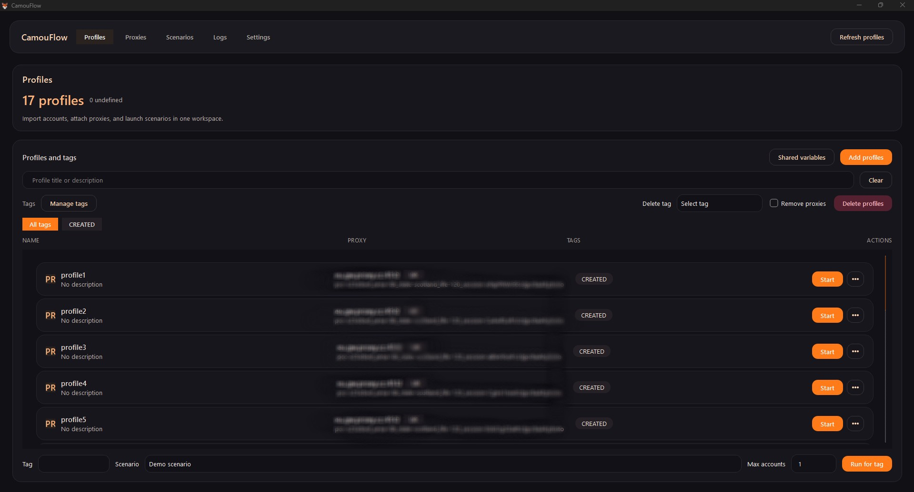
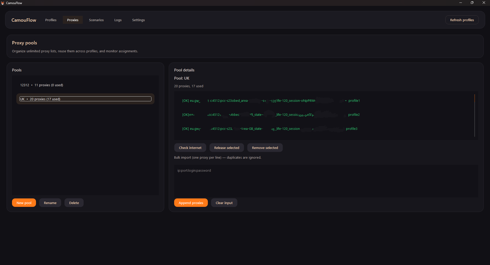
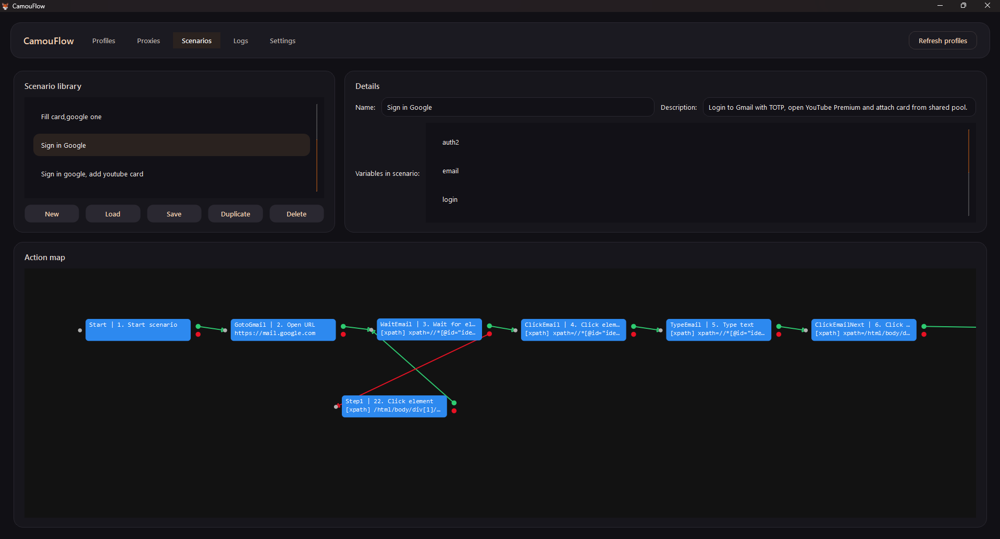
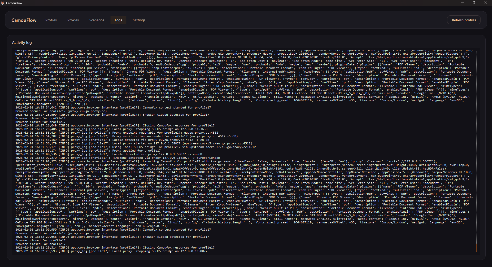
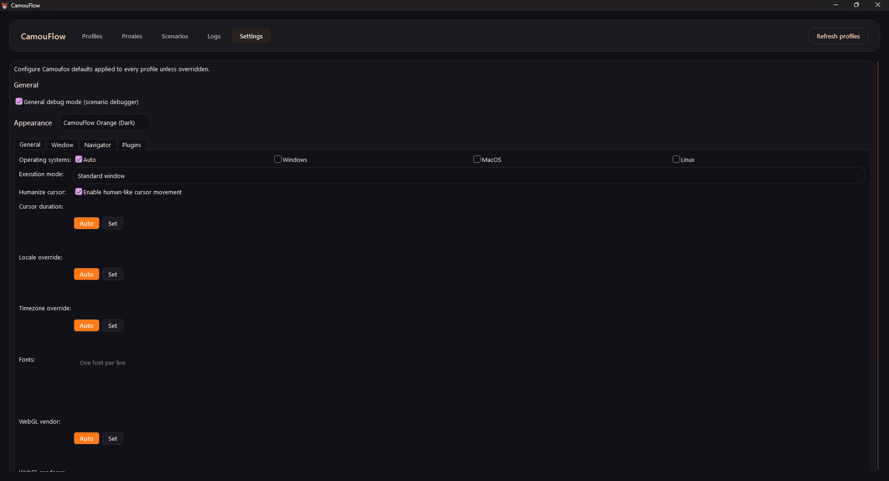

# CamouFlow

CamouFlow is a desktop app for managing browser automation scenarios and profiles based on Camoufox/Playwright. It is built with PyQt6 and stores its working data locally.

<details>
  <summary>Screenshots</summary>

  <p align="center">
    
    
    
    
    
  </p>
</details>

## Features

- manage profiles and accounts
- configure and run scenarios and steps
- logging and saving run results
- local storage for settings and profiles

## Installation

Requirements: Python 3.11+.

```bash
py -m venv .venv
.venv\Scripts\activate
pip install -r requirements.txt
pip install pyinstaller
```

## Run

```bash
python main.py
```

Note: the first launch may take a while because Camoufox is downloaded automatically.

## License

MIT
